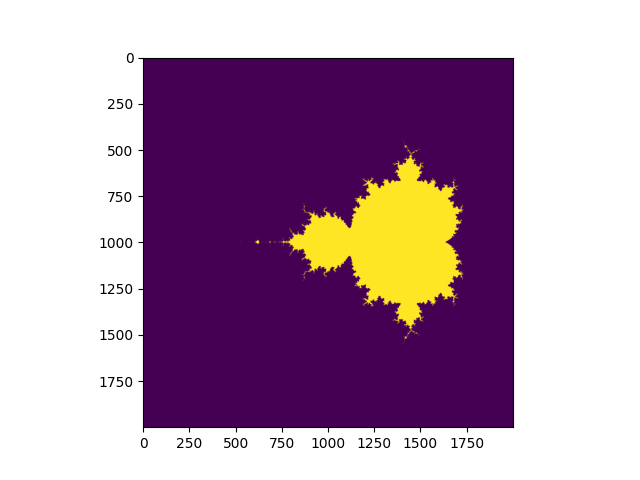
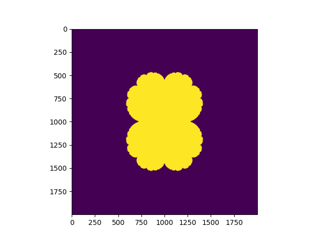

# Mandelbrot

An implementation of Mandelbrot Set by using python.

This is inspired by the book "The Emperor's New Mind".

> Its wonderfully elaborate structure was not the invention of any one person, nor was it the design of a team of mathematicians.  
> p.124

> The Mandelbrot set is not an invention of the human mind: it was a discovery.  
> Like Mount Everest, the Mandelbrot set is just there!  
> p.125

### Mandelbrot

### Julia

### Reference
* Roger Penrose : The Emperor's New Mind - Concerning Computers, Minds, and The Laws of Physics, Oxford University Press (1989)
* https://realpython.com/mandelbrot-set-python/#understanding-the-mandelbrot-set
